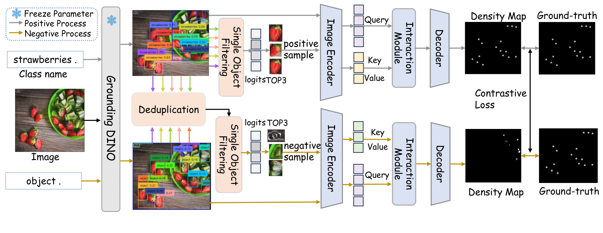

# VA-Count
[ECCV 2024] Zero-shot Object Counting with Good Exemplars
[[paper](https://arxiv.org/abs/2407.04948)]   

# Zero-shot Object Counting with Good Exemplars
## News
VA-Count is accepted by ECCV2024. 
Our code will be available soon！
## Overview 
Overview of the proposed method. The proposed method focuses on two main elements: the Exemplar Enhancement Module (EEM) for improving exemplar quality through a patch selection integrated with Grounding DINO, and the Noise Suppression Module (NSM) that distinguishes between positive and negative class samples using density maps. It employs a Contrastive Loss function to refine the precision in identifying target class objects from others in an image.
## Environment
```
pip install torch==1.10.0+cu111 torchvision==0.11.0+cu111 torchaudio==0.10.0 -f https://download.pytorch.org/whl/torch_stable.html
pip install timm==0.3.2
pip install numpy
pip install matplotlib tqdm 
pip install tensorboard
pip install scipy
pip install imgaug
pip install opencv-python
pip3 install hub
```
--For more information on Grounding DINO, please refer to the following link: 
https://github.com/IDEA-Research/GroundingDINO
We are very grateful for the Grounding DINO approach, which has been instrumental in our work！
